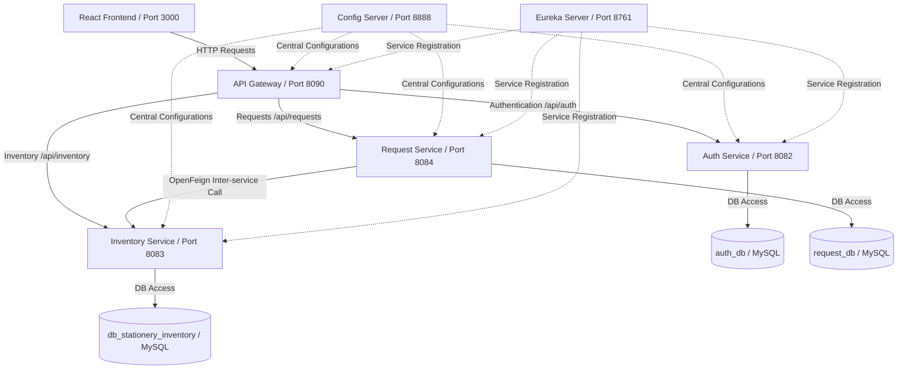

# Capstone Project: Stationery Management System

The **Stationery Management System** is a production-grade microservices-based web application designed to manage stationery allocations, track inventories, and handle student requisitions with automated approval workflows.

---

## 🏛️ Microservices Architecture

The application is built using a cloud-native, decentralized architecture consisting of the following modules:

### 1. Infrastructure Services
* **Config Server (Port 8888)**: Serves native file configurations from [stationery-config-repo](file:///C:/Users/Asus/OneDrive/Desktop/Sprint_Stationary_Management_System/stationery-config-repo) to all services.
* **Eureka Discovery Server (Port 8761)**: Handles registry discovery of active microservice instances.
* **API Gateway (Port 8090)**: Serves as the single entry point, handles CORS, and routes endpoints (e.g., `/api/requests/**` -> Request Service).

### 2. Core Business Services
* **Auth Service (Port 8082)**: Manages student and admin accounts, encrypts passwords using BCrypt, and issues signed JWT tokens containing roles.
* **Inventory Service (Port 8083)**: Manages catalog listings, prices, categories, and handles stock additions and deductions (`/api/inventory/{id}/stock`).
* **Request Service (Port 8084)**: Tracks stationery requests, processes approvals (validates stock availability and triggers automated deductions in `inventory-service` via OpenFeign), and processes rejections.

---

## 💻 Tech Stack

* **Backend**: Spring Boot 3.3.x, Spring Cloud (Config, Eureka, Gateway, OpenFeign), Spring Security, Java 17/25.
* **Database**: MySQL 8.x (separate schemas: `auth_db`, `db_stationery_inventory`, `request_db`).
* **ORM**: Spring Data JPA & Hibernate.
* **Frontend**: React (Vite, CSS, Lucide icons, responsive layout).
* **CI/CD & DevOps**: Docker, Docker Compose, Jenkinsfile pipelines.

---

## 🔑 Port Map & Routing

| Service Name | Port | Context Root | Database Schema |
|---|---|---|---|
| **API Gateway** | `8090` | `/` | *None* |
| **Auth Service** | `8082` | `/api/auth` | `auth_db` |
| **Inventory Service**| `8083` | `/api/inventory` | `db_stationery_inventory` |
| **Request Service**  | `8084` | `/api/requests` | `request_db` |
| **Eureka Server**    | `8761` | `/` | *None* |
| **Config Server**    | `8888` | `/` | *None* |
| **Vite Frontend**    | `3000` | `/` | *None* |

---

## 📡 REST API Documentation

### 🔓 Authentication Endpoints
* `POST /api/auth/register` : Registers a user. Body accepts: `name`, `email`, `password`, `role` (`STUDENT`, `ADMIN`).
* `POST /api/auth/login` : Authenticates user credentials. Returns signed JWT token and user info.

### 📦 Inventory Endpoints (Admin & Student)
* `GET /api/inventory` : Retrieves all stationery items.
* `GET /api/inventory/{id}` : Retrieves details for a specific item.
* `POST /api/inventory` : Creates a new item (Admin only).
* `PUT /api/inventory/{id}` : Updates an item details (Admin only).
* `DELETE /api/inventory/{id}` : Deletes an item (Admin only).
* `PUT /api/inventory/{id}/stock` : Adjusts stock level (`ADD`, `REDUCE`, `SET`).
* `GET /api/inventory/search?query=...` : Searches items by name or category.
* `GET /api/inventory/low-stock` : Retrieves items under their threshold limit.

### 📝 Stationery Request Endpoints
* `POST /api/requests` : Submits request ticket (Student only).
* `GET /api/requests/my` : Lists requests submitted by current student.
* `GET /api/requests/{id}` : Details of a request.
* `GET /api/requests` : Lists all requests (Admin only).
* `PUT /api/requests/{id}/approve` : Approves ticket and triggers stock deduction (Admin only).
* `PUT /api/requests/{id}/reject` : Rejects request ticket (Admin only).

---

## 🐳 Containerization & Pipelines

* **Dockerfiles**: Every core service incorporates its own multi-stage `Dockerfile` to produce minimal JRE containers.
* **docker-compose.yml**: Orchestrates all services, ensuring sequential boot using dependencies-healthchecks.
* **Jenkinsfile**: Features declarative CI pipeline stages: checkout, compile, test, JAR package, and docker build registry.
